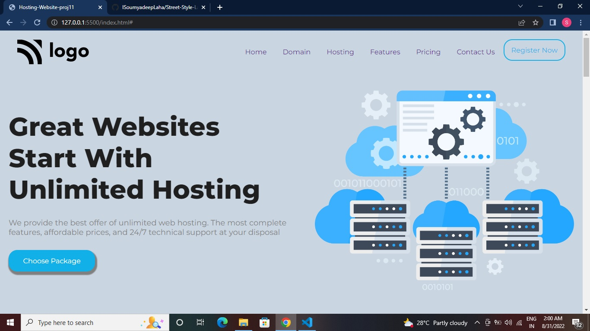
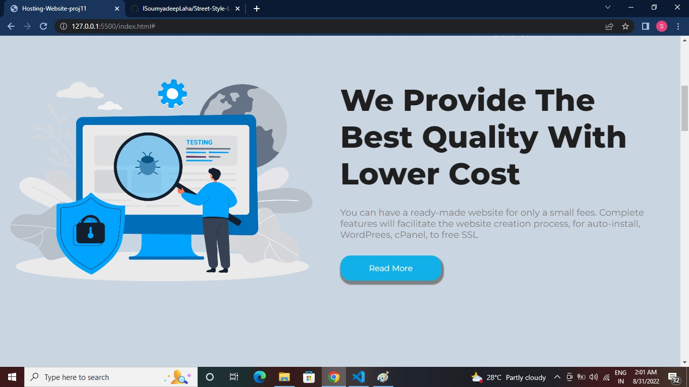
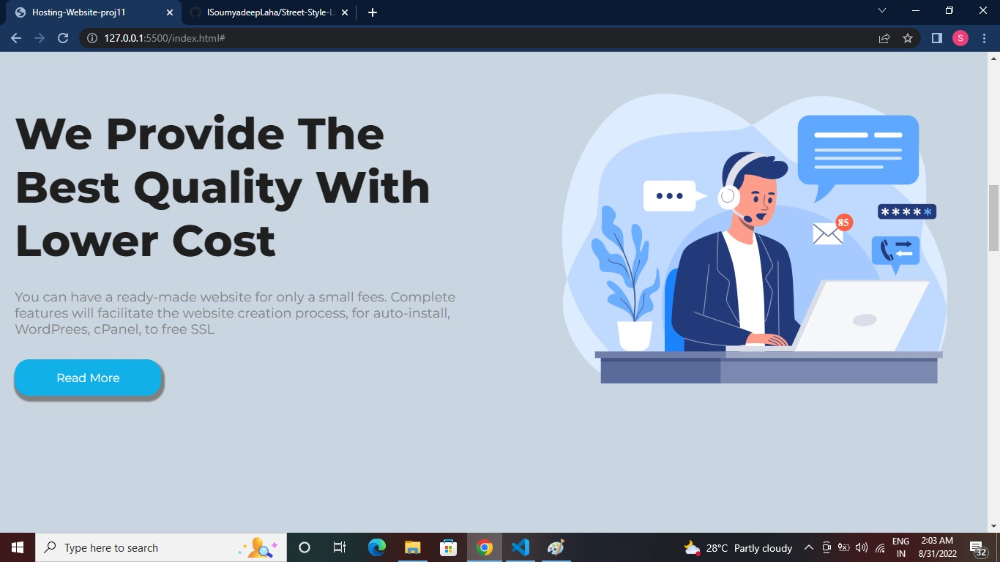
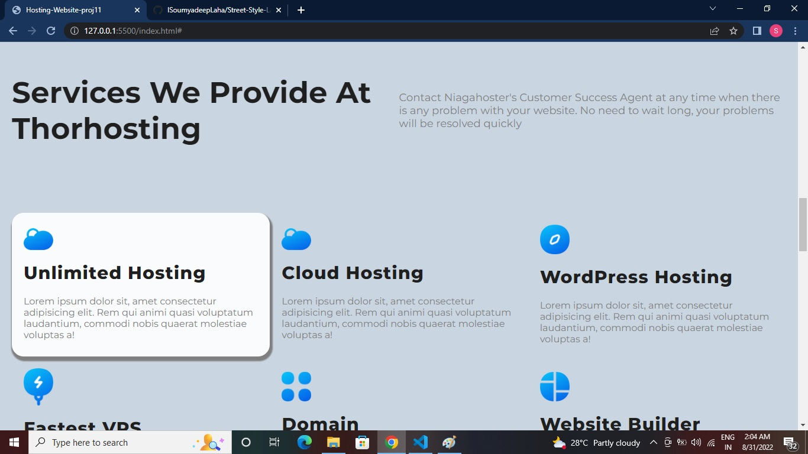
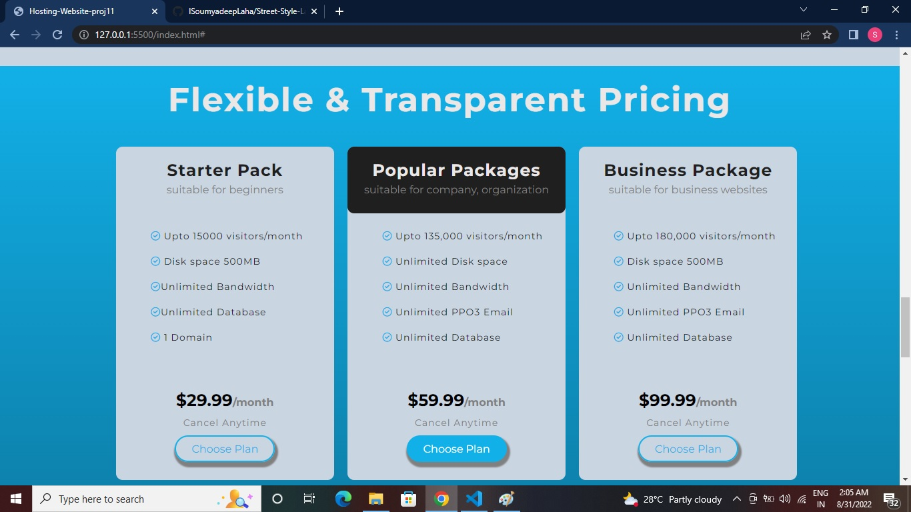
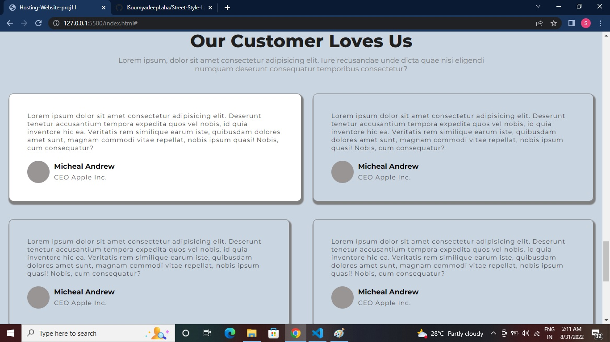
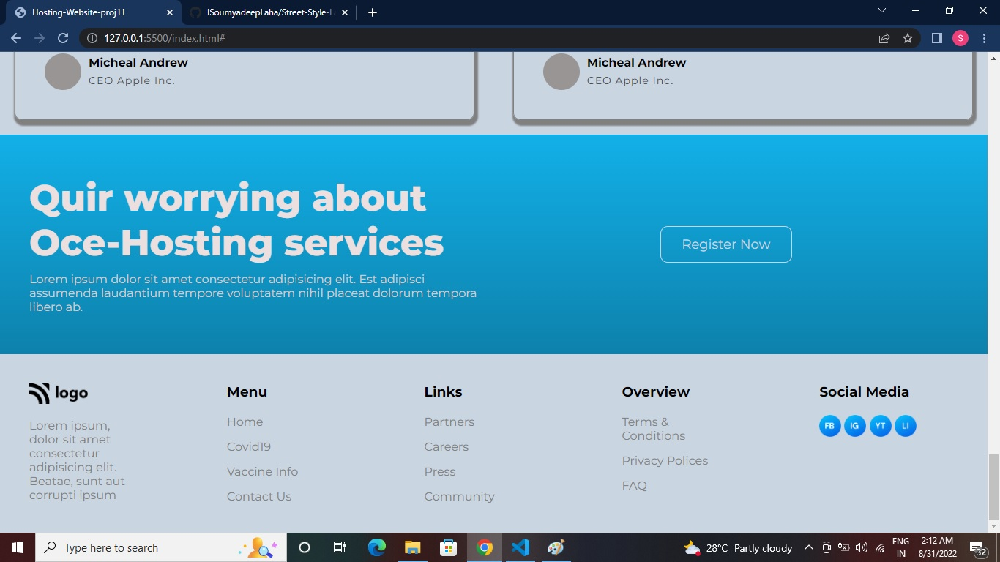

# Hosting Website UI Design (Project 11)

by Soumyadeep Laha

# Learnings from the project:

- About the display grid property.
- How to make beautiful cards using CSS core.
- Learned more about flexbox in-depth.

# Time taken to complete this project:

It tooked me about 6 hours.

# Screen Shorts of the project:

------

---------

---------

----------

----------

----------

# Live link to the project 

[Netlify Link...](https://hosting-website-proj11.netlify.app/)